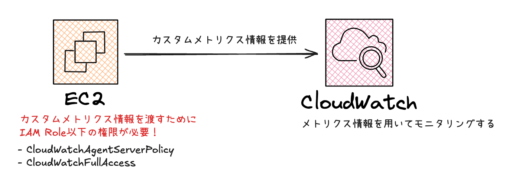

## はじめに

### 環境
OS: AmazonLinux2023

この記事ではCloudWatchのメトリクス中でも「カスタムメトリクス」を利用したEC2のディスク使用率のモニタリングを説明します。




メトリクスとは？

システムの状態を数値で表したデータです。主にパフォーマンスのモニタリングや分析のために使用され、時間の経過に伴って収集されたデータにの推移を把握することができます。


### メトリクスの種類


| 種類               | 説明                                           | 例                              |
| ------------------ | ---------------------------------------------- | ------------------------------- |
| 標準メトリクス      | AWSサービスがデフォルトで提供するメトリクス       | EC2のCPU使用率、RDSのディスクI/Oなど   |
| カスタムメトリクス  | ユーザーが自分で定義して収集するメトリクス       | ディスク使用率、リクエスト応答時間、メモリ使用率など   |


## CloudWatch Agent設定

### CloudWatch Agentインストール

カスタムメトリクスをCloudWatchに提供するためにはCloudWatch Agentが必要です。
EC2にCloudWatch Agentを入れましょう。

``` EC2.AmazonLinux2023
sudo yum install amazon-cloudwatch-agent
```

### amazon-cloudwatch-agent.json設定

``` /opt/aws/amazon-cloudwatch-agent/etc/amazon-cloudwatch-agent.json
{
  "metrics": {
    "metrics_collected": {
      "disk": {
        "measurement": [
          "used_percent"
        ],
        "resources": [
          "/"
        ],
        "ignore_file_system_types": [
          "sysfs", "tmpfs"
        ]
      }
    }
  }
}
```

`resources`はモニタリングしたいディレクトリを設定します。
今回はルートディレクトリを設定しました。

### amazon-cloudwatch-agent.json設定を適用する

``` EC2.AmazonLinux2023
sudo /opt/aws/amazon-cloudwatch-agent/bin/amazon-cloudwatch-agent-ctl \
-a fetch-config -m ec2 -c file:/opt/aws/amazon-cloudwatch-agent/etc/amazon-cloudwatch-agent.json -s
```

これでEC2側からCloudWatchにディスク容量のデータを送れるようになりました！


### ログを見て動作を確認する


EC2がCloudWatchにアクセスできるようにIAM Role設定をしないと、EC2からスタムメトリクスのデータを提供することができません。

以下はエラーログです。

``` /opt/aws/amazon-cloudwatch-agent/logs/amazon-cloudwatch-agent.log
status code: 404, request id:
2025-02-27T08:32:42Z W! cloudwatch: 1665 retries, going to sleep 41008 ms before retrying.
2025-02-27T08:33:23Z E! cloudwatch: WriteToCloudWatch failure, err:  NoCredentialProviders: no valid providers in chain
caused by: EnvAccessKeyNotFound: failed to find credentials in the environment.
SharedCredsLoad: failed to load profile, .
EC2RoleRequestError: no EC2 instance role found
caused by: EC2MetadataError: failed to make EC2Metadata request
```

## IAM Role設定

// TODO: 今後追記する

## CloudWatchからslackで通知設定

// TODO: 今後追記する
