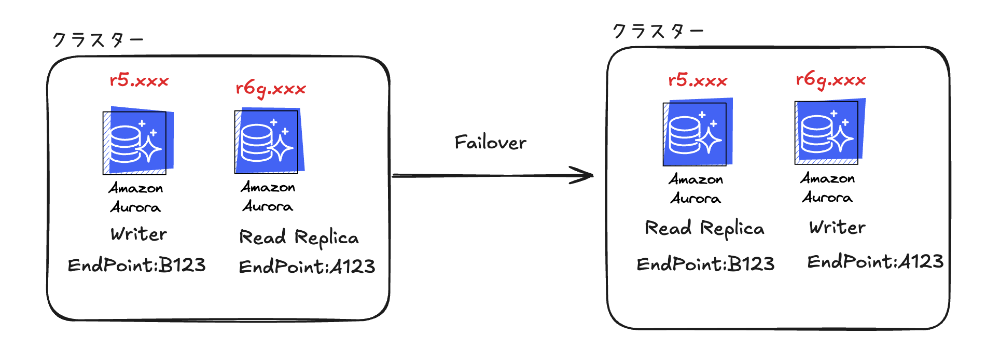

## 背景
会社でリザーブドインスタンス契約をし直しました。
（r5ファミリ→r6gファミリー）
そのため、既存のr5ファミリーを使うインスタンスたちをr6gにする必要がありました。

## なぜFailoverを？

1. 広告配信サービスは24時間稼働していてDBのダウンタイムをできるだけ短くしたかった。
2. 深夜時間帯は新たな書き込みがなかった。レプリケーションの心配はなかったので安全にデータの同期を確保できました。

## 事前注意事項⚠️

- **Read ReplicaのFailoverの場合、ライターインスタンスのエンドポイントが変わる**
    - アプリケーションがクラスターのライターインスタンスのエンドポイントに向いていることをチャックしましょう。
- **Read Replicaが最終的にライターインスタンスになります。**
    - 完全にデータ同期が行われてないかもしれません。ReplicationRagなどを確認して、データの同期を確認しましょう。
- **Failover中はダウンタイムが発生することを念頭に置きましょう**
    - およそ１〜２分

## 作業手順

1. **Read Replicaを作成**  
   変更したいインスタンスタイプのRead Replicaを作成します。

2. **データ同期の確認**  
   Read Replicaが最新のデータを保持しているか確認します。これを確認しないと、Failover後にデータ不整合が発生する可能性があります⚠️

3. **Failoverを実行**  
   Read ReplicaをWriterインスタンスに昇格させ、Failoverを行います。

4. **Connection Poolを貼り直し**  
Connection Poolを使用していたのでConnectionの貼り直し作業をしました。

5. **ライターインスタンスのモニタリング**
    書き込みのテストを行い、書き込みが正常に動作することを確認しました。

6. **旧ライター(新Read)インスタンスの削除**。
    元々Readerインスタンスは使用しないDBだったので、料金を抑えるため削除しました。

**作業完了です！**
